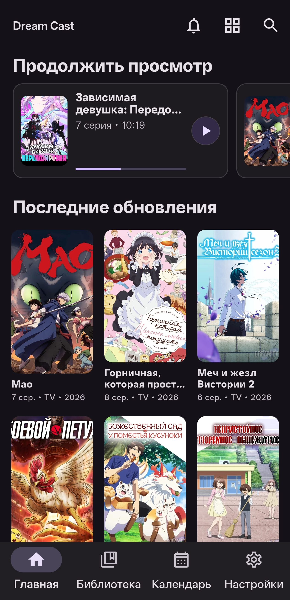
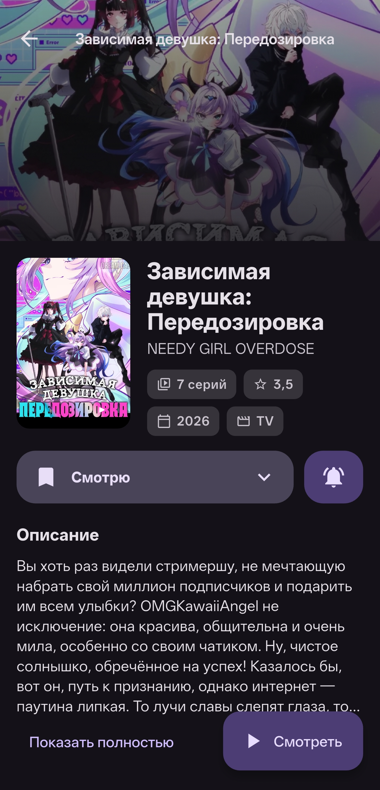
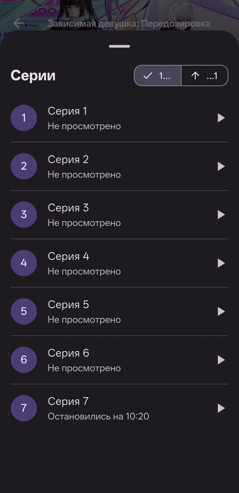
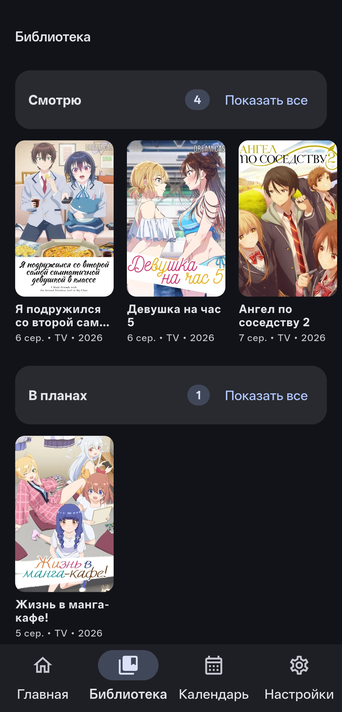
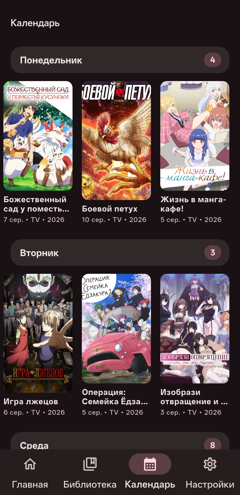
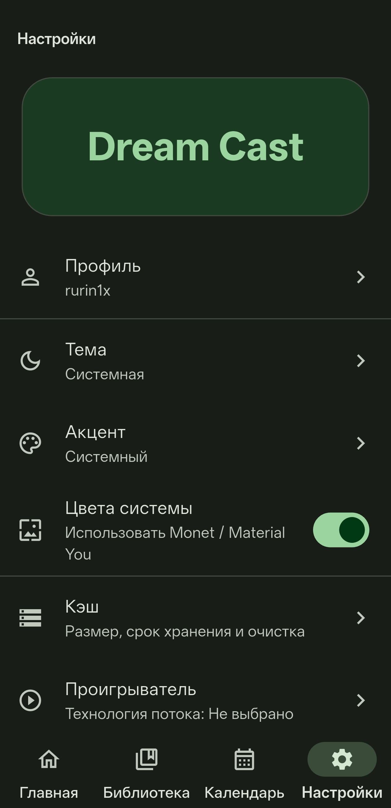
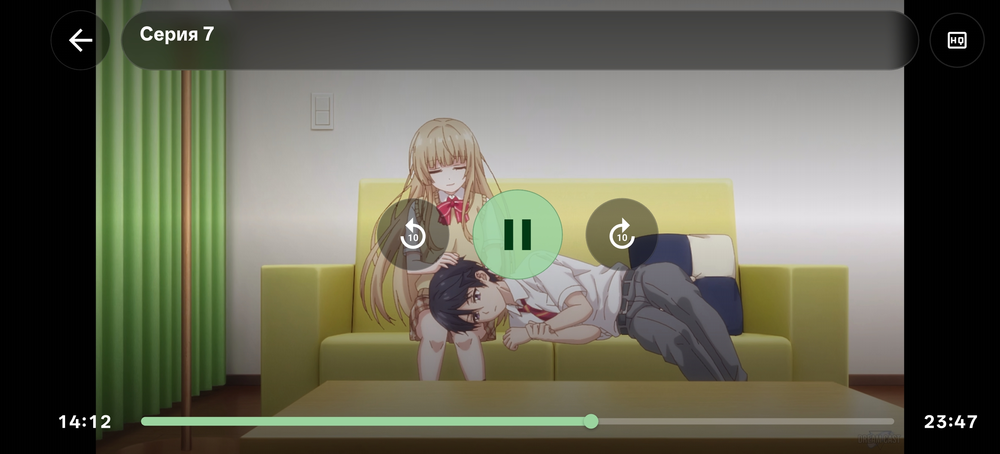

<p align="center">
  
</p>

<h1 align="center">Dream Cast</h1>

<p align="center">
  Современный Android-клиент для просмотра аниме в озвучке Dream Cast.
</p>

<p align="center">
  
  
  
</p>

---
<br>
<p align="center">
  <a href="https://github.com/rurin1x/dreamcast-app/releases/latest">
    
  </a>
</p>


## ⚠️ Региональные ограничения

Dream Cast может быть недоступен в некоторых странах и сетях из-за ограничений провайдеров.

Подтверждённые проблемы доступа:
**Россия,** Austria, Belgium, Canada, China, Czech Republic, Denmark, Estonia, France, Germany, Greece, Hong Kong, Hungary, India, Ireland, Italy, Japan, Luxembourg, Malta, Portugal, Romania, Slovakia, Slovenia, Spain, United Kingdom, United States Minor Outlying Islands и United States.

Если приложение не загружает релизы или видео — попробуйте использовать VPN (Финляндия или Нидерланды).


## Скриншоты

<p align="center">
  
  
  

  
</p>
<p align="center">
    
    
    
</p>

<p align="center">
  
</p>

## Что умеет

- Просмотр серий в озвучке Dream Cast
- Постеры, описания и метаданные
- Поиск по тайтлам
- Закладки и библиотека
- Сохранение прогресса просмотра
- Поддержка HLS и DASH
- Picture-in-Picture
- Календарь релизов
- Уведомления о новых сериях
- Локальный кэш


## Внутри

Приложение не использует WebView.
Все данные обрабатываются напрямую через парсер и локальный слой приложения:

```text
Dream Cast
→ Dio
→ HTML/API parser
→ PlayerJS decoder
→ Repository
→ Drift cache
→ Riverpod providers
→ Flutter UI
```

Основные технологии:

- Flutter / Dart
- Riverpod
- GoRouter
- Dio
- Drift
- Material 3
- dynamic_color
- video_player
- Workmanager
- flutter_local_notifications

## Сборка

Нужны Flutter SDK и Android Studio с Android SDK.

```bash
flutter pub get
flutter analyze
flutter test
flutter build apk --debug
```

Для релизной сборки:

```bash
flutter build apk --release
```


## Структура

```text
lib/
  app/          запуск приложения, роутер, тема
  core/         база данных, сеть, настройки, логирование
  features/
    home/       главная страница
    library/    закладки и библиотека
    notifications/
    onboarding/
    player/
    profile/
    releases/   парсинг, репозитории и экраны тайтлов
    schedule/
    settings/
```

## Лицензия

Проект распространяется по лицензии GPLv3.

Некоторые идеи парсинга вдохновлены проектом [anicli-api](https://github.com/vypivshiy/anicli-api) (MIT License).

Реализация для приложения переписана на Dart.

## Благодарности

Спасибо Dream Cast за прекрасную озвучку, open-source сообществу за инструменты.
Спасибо людям, которые тестировали приложение и помогали находить проблемы на ранних этапах разработки.

---

<p align="center">
  Dream Cast · GPLv3 · 2026
</p>
